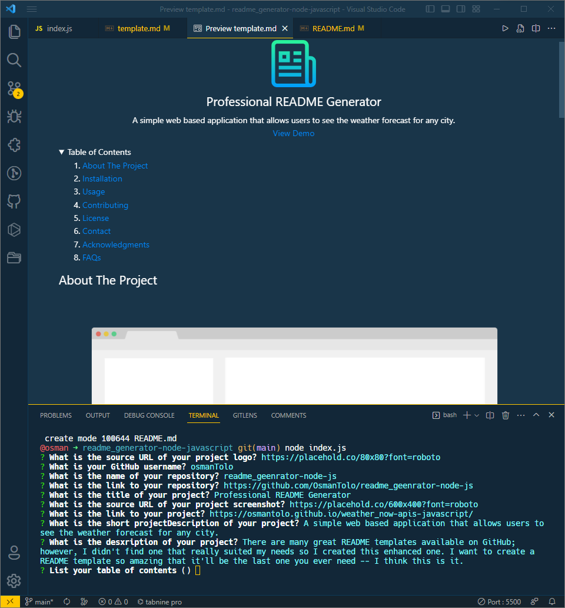

 

  <h1 align="center">Custom README Generator</h1>
  

    A command-line application that dynamically generates a professional README.md file based on a user's input.
     
    <a href="http://127.0.0.1:5500/index.html">View Walthrough Video</a>
  

## About The Project

This repo presents a command line interface (CLI) application that allows a user to dynamically generate a high-quality README for their project repository. The application will run in the users CLI of their integrated development environment (IDE) using [Node.js](https://nodejs.org/en/).

The user is presented with a series of questions using the [Inquirer package](https://www.npmjs.com/package/inquirer), which requirres the user to input answers about their project. The answers provided are used to fill in the different sections of the README.

The repo serves as my solution to the Module 11 - Professional README Generator Challenge of Trilogy Skills Front-End Development Boot Camp.

The project provide evidence of my ability to work with Node packages and asynchronous functions in JavaScript. The result is an intuitive application that can save developers time, for them to focuse on creating projects that solve problems and help others.

## Usage

Visit this github repo [link](https://github.com/OsmanTolo/readme_geenrator-node-js) to access the code. To use it, clone the repository to your local directory and run 'node index.js' in your IDE's CLI window.

## License

Distributed under the MIT License.

## Contact

Osman Dumbuya - [@OsmanTolo\_](https://twitter.com/OsmanTolo_)

Project Link: [https://github.com/OsmanTolo/readme_geenrator-node-js/tree/main](https://github.com/OsmanTolo/readme_geenrator-node-js/tree/main)

## Acknowledgments

- [Skills for Life](https://skillsforlife.campaign.gov.uk/courses/skills-bootcamps/)
- [Othneil Drew's Best-README-Template](https://github.com/othneildrew/Best-README-Template)
- [Lukas Himsel's Markdown License badges](https://gist.github.com/lukas-h/2a5d00690736b4c3a7ba)
- [Shields IO Badges](https://shields.io/)
